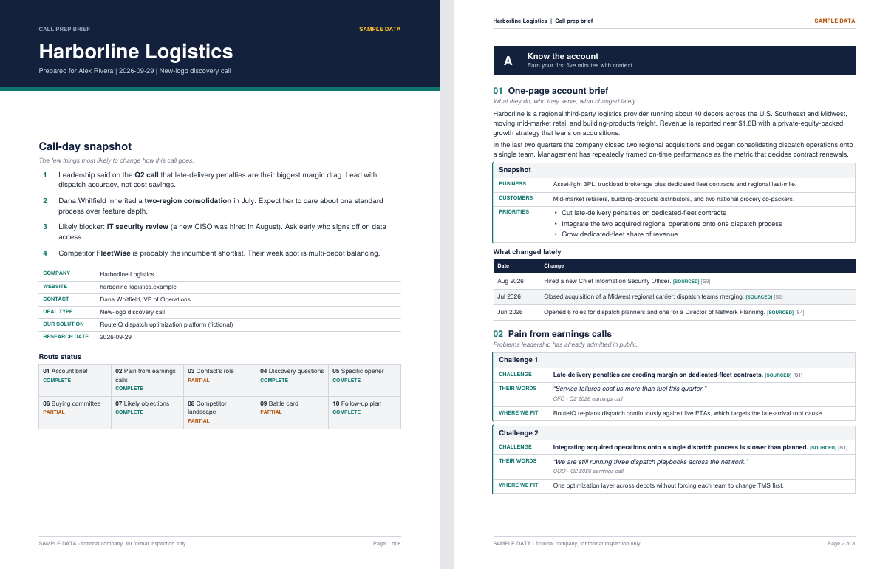

# Sales Call Preparation and Research

Give Claude a company name and get back a formatted PDF call-prep brief. The plugin runs the
ten-stage "call-prep route" so a sales rep never has to write a research prompt.

This skill runs the ten-stage call-prep route end to end: it researches the account, pulls pain points from earnings calls, maps the buying committee, and renders the whole thing as a formatted PDF brief — account brief, discovery questions, a specific two-sentence opener, likely objections, competitor landscape, a five-objection battle card, and a follow-up plan.

No invented facts. Every claim in the brief is tagged sourced (with a citation) or inferred (reasoning, labeled as such). Anything that cannot be verified becomes an explicit gap with an ask the rep can act on ("paste her last 3 posts") — never a plausible-sounding guess. The skill never bypasses logins or paywalls. Here is the process the agent will run through, prompt by prompt automatically, saving your sales team significant research and prep time:

## What you get

A multi-page PDF with a call-day snapshot on page one, then all ten stages:

1. One-page account brief
2. Pain points from earnings calls, with short exact quotes
3. Your contact's role
4. Five open discovery questions with follow-ups
5. A two-sentence opener anchored on something real and recent
6. Buying committee
7. Top three likely objections
8. Competitor landscape
9. A five-objection battle card (real concern, response, proof point, question back)
10. A follow-up email and three value-adding touches

The last page lists every gap (anything gated, missing or unverifiable) with exactly what to paste
so the stage can be re-run. Each claim is tagged SOURCED or INFERRED and cites numbered sources.

## The Process

## Install

**Claude Cowork / Claude desktop app**

The Setup

1. Open Customize, then Plugins, then Add marketplace.
2. Paste `ericgonzalez/Claude-Callprep` and press Sync.
3. Open the synced marketplace, find Call-Prep Route, and install it.
4. Ask your agent to invoke the skill.  Type the following: "I'm going to provide you with some background on our company and products/services before we begin research. I'm going to summarize what we do, ask me questions to clarify once you have read it through our offering"  Then provide the agent with an overview of your offering.
   
The Operation

From then on, anytime your reps need research, have the rep start a new chat and say "Prep me for a call with Acme Corp".

**Claude Code**

    /plugin marketplace add ericgonzalez/Claude-Callprep
    /plugin install call-prep-route@call-prep-route-marketplace

Once the plugin is listed in Anthropic's directory you can also find it by searching for
"Call-Prep Route" under Customize.

## How to use it

Ask in plain words, for example "Prep me for a call with Acme Corp", or run the command:

    /call-prep-route:prep Acme Corp, Jane Smith, VP Operations, new-logo discovery

Only the company name is required. Contact, title and deal type sharpen the result. On the first
run Claude asks one batched question about your own product, then offers to save it as
`call-prep-seller-profile.md` in your working folder so later runs skip the question.

## What this plugin runs, sends and fetches

- **Research:** Claude's own web search and page-fetch tools, against public sources (company site,
  press releases, investor pages, filings, job postings). It does not bypass logins or paywalls;
  gated pages are reported as gaps.
- **PDF:** a local Python script, `skills/call-prep-route/scripts/build_brief_pdf.py`, reads a JSON
  file Claude writes and produces the PDF using the `reportlab` library. The script makes no
  network requests and sends nothing anywhere. If `reportlab` is missing, Claude installs it with pip.
- **No** MCP servers, hooks, credentials, telemetry or background processes. The follow-up email is
  a draft only; nothing is ever sent.

## Design Principles

Never invent names, quotes, prices, metrics or customer results. No invented proof points, everything attributed. Proof points come only from your own profile or cited sources. Competitor pricing appears only when public. Quotes are short and attributed. gated or missing source → recorded in `gaps[]` with a concrete ask.  Quotes are short and exact, with at most two sentences verbatim, with speaker, call, and link — or they're dropped and tagged, because let's face it, your reps are busy.

## License

Released under the MIT License (see LICENSE).

**Hermes Agent users:** use the Hermes version of this skill at
https://github.com/ericgonzalez/HermesAgent-Callprep
